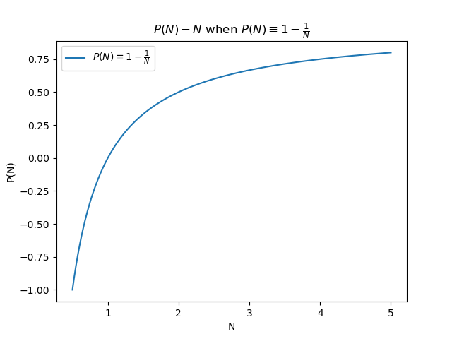
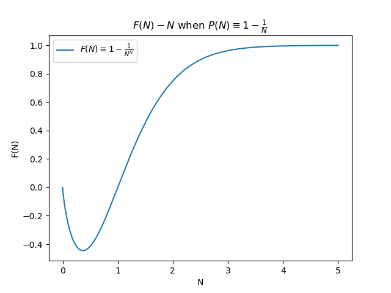
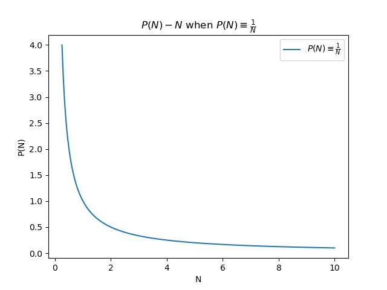
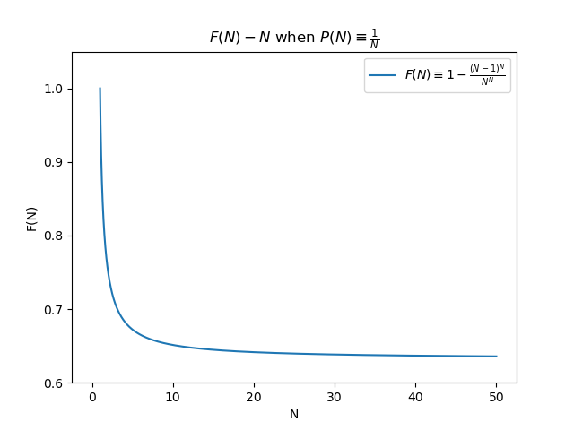
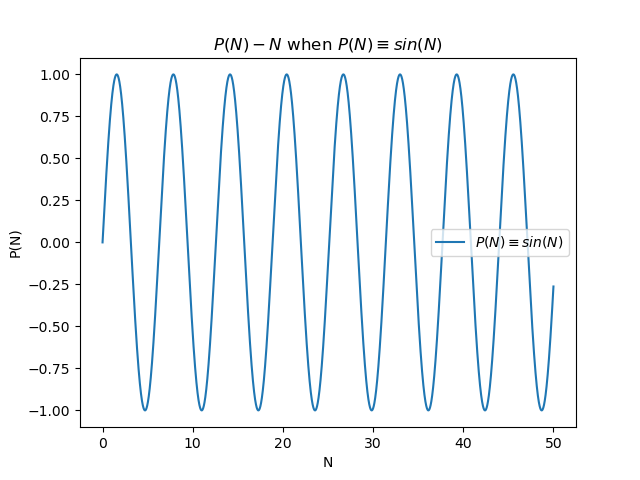
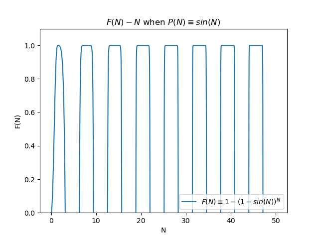

# model

Author: Daniel (danielw10001@gmail.com), BUAA Dept.6 SCSE

## 1. 模型

一个描述对异性的主动程度与不孤独终老的概率之间关系的模型. 使用余生尝试与异性有效认识的次数来描述对异性的主动程度.
注意到对异性的主动程度对每一次尝试中两人合适成为恋人的概率的影响.


以下针对$P(N)$严格单增, 严格单减, 周期变化三类典型情况的典型值分别做讨论.

### 1.1. $P(N)$严格单增

若$P(N) \equiv 1 - \frac {1} {N}$ (严格单增), 则$F(N) \equiv 1 - \frac {1} {N^N}$, 绘制$P(N)$与$F(N)$图像:

```python3
# PRJDIR/src/modelplot1p.py

import numpy
import matplotlib.pyplot

NFROM = 0.5
NTO = 5
NSTEP = 0.0001

nlist = numpy.arange(NFROM, NTO, NSTEP)
plist = [(1-1/n) for n in nlist]

matplotlib.pyplot.title(r"$P(N)-N$ when $P(N) \equiv 1 - \frac {1} {N}$")
matplotlib.pyplot.xlabel(r"N")
matplotlib.pyplot.ylabel(r"P(N)")
matplotlib.pyplot.plot(nlist, plist,
                       label=r"$P(N) \equiv 1 - \frac {1} {N}$")
matplotlib.pyplot.legend()

matplotlib.pyplot.show()
```



```python3
# PRJDIR/src/modelplot1f.py

import numpy
import matplotlib.pyplot

NFROM = 0
NTO = 5
NSTEP = 0.0001

nlist = numpy.arange(NFROM, NTO, NSTEP)
flist = [(1-1/n**n) for n in nlist]

matplotlib.pyplot.title(r"$F(N)-N$ when $P(N) \equiv 1 - \frac {1} {N}$")
matplotlib.pyplot.xlabel(r"N")
matplotlib.pyplot.ylabel(r"F(N)")
matplotlib.pyplot.plot(nlist, flist,
                       label=r"$F(N) \equiv 1 - \frac {1} {N^N}$")
matplotlib.pyplot.legend()

matplotlib.pyplot.show()
```



得最优解${N}_{max} \to + \infty$

### 1.2. $P(N)$严格单减

若$P(N) \equiv \frac {1} {N}$ (严格单减), 则$F(N) \equiv 1 - \frac {(N-1)^N} {N^N}$, 绘制$P(N)$与$F(N)$图像:

```python3
# PRJDIR/src/modelplot2p.py

import numpy
import matplotlib.pyplot

NFROM = 0.25
NTO = 10
NSTEP = 0.0001

nlist = numpy.arange(NFROM, NTO, NSTEP)
plist = [1/n for n in nlist]

matplotlib.pyplot.title(r"$P(N)-N$ when $P(N) \equiv \frac {1} {N}$")
matplotlib.pyplot.xlabel(r"N")
matplotlib.pyplot.ylabel(r"P(N)")
matplotlib.pyplot.plot(nlist, plist,
                       label=r"$P(N) \equiv \frac {1} {N}$")
matplotlib.pyplot.legend()

matplotlib.pyplot.show()
```



```python3
# PRJDIR/src/modelplot2f.py

import numpy
import matplotlib.pyplot

NFROM = 0
NTO = 50
NSTEP = 0.0001

nlist = numpy.arange(NFROM, NTO, NSTEP)
flist = [(1-((n-1)**n)/(n**n)) for n in nlist]

matplotlib.pyplot.title(r"$F(N)-N$ when $P(N) \equiv \frac {1} {N}$")
matplotlib.pyplot.xlabel(r"N")
matplotlib.pyplot.ylabel(r"F(N)")
matplotlib.pyplot.plot(nlist, flist,
                       label=r"$F(N) \equiv 1 - \frac {(N-1)^N} {N^N}$")
matplotlib.pyplot.ylim(0.6, 1.05)
matplotlib.pyplot.legend()

matplotlib.pyplot.show()
```



得最优解${N}_{max} \equiv 1$

### 1.3. $P(N)$周期变化

若$P(N) \equiv sin(N)$ (周期变化), 则$F(N) \equiv 1 - (1 - sin(N))^N$, 绘制$P(N)$与$F(N)$图像:

```python3
# PRJDIR/src/modelplot3p.py

import numpy
import math
import matplotlib.pyplot

NFROM = 0
NTO = 50
NSTEP = 0.0001

nlist = numpy.arange(NFROM, NTO, NSTEP)
plist = [math.sin(n) for n in nlist]

matplotlib.pyplot.title(r"$P(N)-N$ when $P(N) \equiv sin(N)$")
matplotlib.pyplot.xlabel(r"N")
matplotlib.pyplot.ylabel(r"P(N)")
matplotlib.pyplot.plot(nlist, plist,
                       label=r"$P(N) \equiv sin(N)$")
matplotlib.pyplot.legend()

matplotlib.pyplot.show()
```



```python3
# PRJDIR/src/modelplot3f.py

import numpy
import math
import matplotlib.pyplot

NFROM = 0
NTO = 50
NSTEP = 0.0001

nlist = numpy.arange(NFROM, NTO, NSTEP)
flist = [(1-(1-math.sin(n))**n) for n in nlist]

matplotlib.pyplot.title(r"$F(N)-N$ when $P(N) \equiv sin(N)$")
matplotlib.pyplot.xlabel(r"N")
matplotlib.pyplot.ylabel(r"F(N)")
matplotlib.pyplot.plot(nlist, flist,
                       label=r"$F(N) \equiv 1 - (1 - sin(N))^N$")
matplotlib.pyplot.ylim(0, 1.1)
matplotlib.pyplot.legend()

matplotlib.pyplot.show()
```



得最优解${N}_{max} \equiv \frac {\pi} {2} + 2 \pi k, k \in Z$

根据上述讨论, 考虑到$P(N)$未知, 典型的最优解包括$N_{max} \equiv 1$, $N_{max} \to + \infty$, $N_{max} \equiv N(k), k \in Z$

## 2. 求解

最优化 (Mathematical Optimization) 常用的方法包括:

- 解析优化 Analytical IOptimization
    - 线性规划 (Linear Programming):
        - 单纯性法 (Simplex Algorithm)
    - 凸优化 (Convex Optimization):
        - 捆集法 (Bundle Adjustment)
        - 次梯度法 (Subgradient Method)
        - 内点法 (Interior Point Method)
        - 切割平面法 (Cutting-Plane Method)
        - Ellipsoid Method
        - Drift-Plus-Penalty Method
- 数值优化 Numerical Optimization
    - 梯度下降法 Gradient Descent
    - 牛顿-拉弗森法 Newton-Raphson Method
    - 演化算法 Evolutionary Algorithm
        - 遗传算法 Genetic Algorithm

但, 由于模型无法确定化, 暂时无法求解.
即, 由于$P(N)$无法确定, 无法采用解析法求解; 由于缺少 (大量) 数据, 无法对$P(N)$进行拟合, 也无法采用数值法求解.

